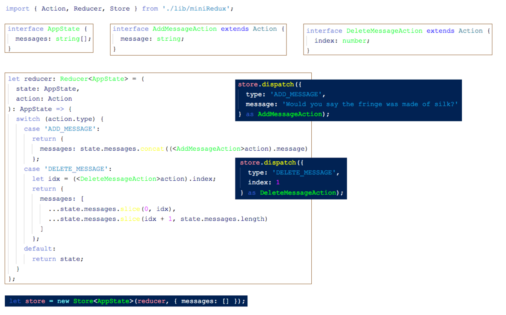

In all Redux apps, there are three main parts to the data model:
    1. The state 
    2. The actions 
    3. The reducer

Our app will process two actions: 

`ADD_MESSAGE`

    - Always have the property message, the message to be added to the state. 
    - The ADD_MESSAGE action object has this shape

    { 
    type: 'ADD_MESSAGE', message: 
    'Whatever message we want here'
    }

`DELETE_MESSAGE`

    - Will delete a specified message from the state. 
    need to specify which message we want to delete. 
    - Could assign each message an id property when it is created. 
    - (or just use the index of the message in the array)
    { 
    type: 'DELETE_MESSAGE', message: 
    index: 2
    }

There are four common non-mutating operations:

    • Adding an item to an array 
    • Removing an item from an array 
    • Adding / changing a key in an object 
    • Removing a key from an object

Our three dispatch statements are a bit ugly for two reasons:
    
    1. we manually have to specify the type string each time. We could use a constant, but it would be nice if we didn’t have to do this and 
    2. we’re manually casting to an AddMessageAction Instead of creating these objects as an object directly we should create a function that will create these objects.

    This idea of writing a function to create actions is so common in Redux that the pattern has a name: Action Creators.
